# 🚀 Shimmer Onboarding Hub

A modern, AI-powered HR document management and Q&A system built with React, Node.js, and advanced RAG (Retrieval-Augmented Generation) technology.


## 📋 Table of Contents

- [Overview](#overview)
- [Features](#features)
- [Workflow Architecture](#workflow-architecture)
- [Technology Stack](#technology-stack)
- [Quick Start](#quick-start)
- [Environment Setup](#environment-setup)
- [API Endpoints](#api-endpoints)
- [Project Structure](#project-structure)
- [Contributing](#contributing)
- [License](#license)

## 🎯 Overview

Shimmer Onboarding Hub is an intelligent HR document management system that allows employees to upload company documents and ask questions about HR policies, benefits, and procedures. The system uses advanced AI to provide accurate, context-aware answers based on the uploaded documents.

### Key Capabilities

- **📄 Multi-format Document Support**: PDF, Word documents, and text files
- **🧠 Smart Text Processing**: Intelligent chunking and embedding generation
- **🔍 Semantic Search**: Find relevant information using vector similarity
- **💬 AI-Powered Q&A**: Get accurate answers with source citations
- **🎨 Modern UI**: Beautiful, responsive interface built with shadcn/ui
- **🔒 Secure**: Role-based access control for HR and Employee portals

## ✨ Features

### For Employees
- Upload and manage HR documents
- Ask questions about company policies
- Get instant, accurate answers with source citations
- View conversation history
- Filter by department-specific information

### For HR Administrators
- Comprehensive document management
- System health monitoring
- Upload tracking and analytics
- Department-specific document organization

## 🔄 Workflow Architecture

```mermaid
graph TD
    A[📄 USER UPLOADS FILE] --> B[📝 TEXT EXTRACTION]
    B --> C[✂️ SMART CHUNKING]
    C --> D[🧠 GENERATE EMBEDDINGS]
    D --> E[🗄️ STORE IN PINECONE]
    E --> F[❓ USER ASKS QUESTION]
    F --> G[🔍 QUESTION → EMBEDDING]
    G --> H[🔎 VECTOR SIMILARITY SEARCH]
    H --> I[📖 RETRIEVE RELEVANT CHUNKS]
    I --> J[🤖 GENERATE ANSWER]
    J --> K[📤 RETURN ANSWER + SOURCES]
    
    B --> B1[PDF: pdf-parse]
    B --> B2[DOCX: mammoth]
    B --> B3[TXT: fs.readFile]
    
    C --> C1[Custom chunking logic]
    C --> C2[Overlap handling]
    C --> C3[Size optimization]
    
    D --> D1[OpenAI text-embedding-3-large]
    D --> D2[Batch processing]
    D --> D3[Error handling]
    
    H --> H1[Top-K similarity search]
    H --> H2[Confidence scoring]
    H --> H3[Department filtering]
    
    J --> J1[GPT-3.5-turbo]
    J --> J2[Context-aware responses]
    J --> J3[Source attribution]
    
    style A fill:#e1f5fe
    style F fill:#e1f5fe
    style K fill:#e8f5e8
    style J fill:#fff3e0
```



## 🛠️ Technology Stack

### Frontend
- **React 18** - Modern UI framework
- **TypeScript** - Type-safe development
- **Vite** - Fast build tool and dev server
- **Tailwind CSS** - Utility-first CSS framework
- **shadcn/ui** - Beautiful component library
- **React Router** - Client-side routing

### Backend
- **Node.js** - Server runtime
- **Express.js** - Web framework
- **Multer** - File upload handling
- **pdf-parse** - PDF text extraction
- **mammoth** - Word document processing

### AI & Vector Database
- **OpenAI API** - Embeddings and chat completions
- **Pinecone** - Vector database for similarity search
- **Custom RAG Pipeline** - Retrieval-augmented generation

### Development Tools
- **ESLint** - Code linting
- **PostCSS** - CSS processing
- **TypeScript** - Type checking

## 🚀 Quick Start

### Prerequisites
- Node.js 18+ 
- npm or yarn
- OpenAI API key
- Pinecone API key

### Installation

1. **Clone the repository**
```bash
git clone <your-repo-url>
cd shimmer-onboarding-hub
```

2. **Install dependencies**
```bash
# Install frontend dependencies
npm install

# Install backend dependencies
cd backend
npm install
cd ..
```

3. **Set up environment variables**
```bash
# Copy environment template
cp .env.example .env
```

4. **Configure your environment variables**
```env
# OpenAI Configuration
OPENAI_API_KEY=your_openai_api_key_here
EMBEDDING_DIMENSIONS=2048

# Pinecone Configuration
PINECONE_API_KEY=your_pinecone_api_key_here
PINECONE_INDEX_NAME=hrdocs

# File Processing
CHUNK_SIZE=2000
CHUNK_OVERLAP=400
MAX_FILE_SIZE=10485760
```

5. **Start the development servers**
```bash
# Start backend server (in backend directory)
cd backend
npm start

# Start frontend server (in root directory)
npm run dev
```

6. **Access the application**
- Frontend: http://localhost:5173
- Backend API: http://localhost:3000

## 🔧 Environment Setup

### Required Environment Variables

| Variable | Description | Default |
|----------|-------------|---------|
| `OPENAI_API_KEY` | OpenAI API key for embeddings and chat | Required |
| `PINECONE_API_KEY` | Pinecone API key for vector database | Required |
| `PINECONE_INDEX_NAME` | Pinecone index name | `hrdocs` |
| `EMBEDDING_DIMENSIONS` | Embedding vector dimensions | `2048` |
| `CHUNK_SIZE` | Text chunk size in characters | `2000` |
| `CHUNK_OVERLAP` | Overlap between chunks | `400` |
| `MAX_FILE_SIZE` | Maximum file upload size (bytes) | `10485760` |

### Optional Environment Variables

| Variable | Description | Default |
|----------|-------------|---------|
| `PORT` | Backend server port | `3000` |
| `NODE_ENV` | Environment mode | `development` |

## 📡 API Endpoints

### File Upload
- `POST /api/upload` - Upload and process documents
- `GET /api/upload/stats` - Get upload statistics

### Chat & Q&A
- `POST /api/chat` - Ask questions about documents
- `GET /api/chat/health` - System health check

### Response Format
```json
{
  "response": "AI-generated answer",
  "sources": [
    {
      "filename": "employee-handbook.pdf",
      "score": 0.85,
      "department": "hr"
    }
  ],
  "contextUsed": true,
  "relevantChunks": 3,
  "totalSearchResults": 5,
  "confidenceLevel": "high"
}
```

## 📁 Project Structure

```
shimmer-onboarding-hub/
├── frontend/                 # React frontend application
│   ├── src/
│   │   ├── components/      # React components
│   │   ├── pages/          # Page components
│   │   ├── hooks/          # Custom React hooks
│   │   └── lib/            # Utility functions
│   ├── public/             # Static assets
│   └── package.json
├── backend/                 # Node.js backend application
│   ├── src/
│   │   ├── controllers/    # Request handlers
│   │   ├── services/       # Business logic
│   │   ├── routes/         # API routes
│   │   ├── middleware/     # Express middleware
│   │   └── utils/          # Utility functions
│   ├── uploads/            # File upload directory
│   └── package.json
├── .env.example            # Environment variables template
├── .gitignore             # Git ignore rules
└── README.md              # This file
```

## 🤝 Contributing

We welcome contributions! Please follow these steps:

1. Fork the repository
2. Create a feature branch (`git checkout -b feature/amazing-feature`)
3. Commit your changes (`git commit -m 'Add amazing feature'`)
4. Push to the branch (`git push origin feature/amazing-feature`)
5. Open a Pull Request

### Development Guidelines

- Follow TypeScript best practices
- Write meaningful commit messages
- Test your changes thoroughly
- Update documentation as needed

## 📄 License

This project is licensed under the MIT License - see the [LICENSE](LICENSE) file for details.

## 🙏 Acknowledgments

- [OpenAI](https://openai.com/) for powerful AI capabilities
- [Pinecone](https://www.pinecone.io/) for vector database
- [shadcn/ui](https://ui.shadcn.com/) for beautiful components
- [Vite](https://vitejs.dev/) for fast development experience

---

**Made with ❤️ for better HR experiences**
